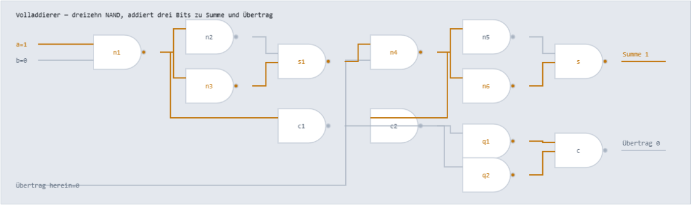

# Rechenwerk

Ein Computer aus NAND-Gattern. Von einem einzigen Grundbaustein bis zu einem laufenden
Programm — und man kann bis auf das einzelne Gatter hinunterschauen, während gerechnet wird.

### → [Öffnen](https://ssims437.github.io/rechenwerk/)

Eine einzelne HTML-Datei. Kein Build, keine Bibliothek, nichts verlässt den Browser.



Dreizehn NAND-Gatter, die gerade `1 + 2` an Bit 0 rechnen. Helle Leitung heißt 1, dunkle 0.
Die Werte stammen aus dem Befehl, der im selben Moment ausgeführt wird.

---

## Was daran Schaltung ist

Ehrlichkeit zuerst, weil die Behauptung sonst nichts wert ist.

**Aus NAND gebaut:**

| Teil | |
|---|---|
| Rechenwerk | acht Operationen: ADD SUB AND OR XOR NOT SHL SHR |
| Addierer | acht Volladdierer in Reihe, je dreizehn NAND |
| Operationsauswahl | Multiplexerbaum aus den drei Opcode-Bits |
| Steuersignale | „subtrahieren", „Übertrag gilt" — alles Gatterlogik |
| Befehlsdecoder | vier Bit hinein, sechzehn Leitungen heraus, genau eine aktiv |
| Programmzähler | zählt durch denselben Addierer weiter |
| **Zustand** | Akkumulator, Programmzähler, Null- und Übertrag-Flag als **Master-Slave-Flipflops**, je neun NAND |

**Nicht aus NAND:** der Speicher. 256 Byte wären 2048 Flipflops — das bleibt ein Feld.
Das steht hier, statt es zu verschweigen.

## Der Beweis auf Knopfdruck

Auf der Seite steckt ein Knopf, der **erschöpfend** prüft: acht Operationen, je alle
65 536 Eingangspaare, gegen eine unabhängige Referenz — Ergebnis, Übertrag und Null-Flag.
Dazu die Speicherglieder: ein Register kann auf drei Arten falsch sein — es übernimmt
nicht, es hält nicht, oder es reicht den Eingang durch, solange der Takt oben steht. Alle
drei über je 256 Werte. Keine Stichprobe.

```
525 056 Fälle geprüft, kein einziger falsch · 1,2 s
Flipflops schwingen nach höchstens 3 Runden ein
```

## Was es kostet

Ein einziger Rechenbefehl braucht **757 NAND-Auswertungen** allein im Rechenwerk. Der
Grund ist kein Fehler, sondern die Bauart: alle acht Operationen werden immer gerechnet,
der Multiplexer wählt erst danach aus. Genau so arbeitet Hardware — parallel und
verschwenderisch, dafür in einem Takt.

Seit die Register echte Flipflops sind, kommt der **Zustand** dazu. Eine Taktflanke auf
alle vier Register kostet zwischen 324 und rund 970 NAND — die Spanne ist keine
Messungenauigkeit, sondern die Sache selbst: ein Flipflop, dessen Bit sich nicht ändert,
ist nach einer Runde ruhig, ein kippendes braucht drei.

| Befehl | NAND | wovon |
|---|---|---|
| `JMP` | 564 | Decoder, Programmzähler, vier Registerflanken |
| `NOP` | 604 – 644 | dasselbe, je nach kippenden Bits |
| `LDI` | 684 – 724 | zusätzlich Akkumulator-Übernahme |
| `ADD` | 1 385 | zusätzlich das ganze Rechenwerk |

Vier mitgelieferte Programme, alle gegen die erwartete Ausgabe geprüft — die Taktzahlen
sind unverändert, nur der Preis je Takt ist gestiegen:

| Programm | Takte | NAND vorher | NAND jetzt | Ergebnis |
|---|---|---|---|---|
| Fibonacci | 146 | 29 420 | **115 484** | 0 1 1 2 3 5 8 13 21 34 |
| Multiplikation | 110 | 27 302 | **94 662** | 13 × 11 = 143 |
| Quadratzahlen | 1 294 | 329 470 | **1 100 366** | 1 4 9 … 225 |
| Herunterzählen | 42 | 11 610 | **34 538** | 10 9 8 … 0 |

Der Zustand kostet also gut das Dreifache des Rechnens. Das ist die zweite unbequeme
Zahl dieses Projekts — und sie stimmt: Register sind in echter Hardware nicht billig,
sie sind nur unsichtbar.

## Die Maschine

8 Bit, ein Akkumulator, 256 Byte gemeinsamer Speicher für Programm und Daten, sechzehn
Befehle mit Vier-Bit-Opcode:

```
NOP  LDA a  STA a  LDI n  ADD a  SUB a  AND a  ORA a
XOR a  JMP a  JZ a  JC a  INC  DEC  OUT  HLT
```

Der Quelltext auf der Seite ist bearbeitbar. Marken mit Doppelpunkt, `;` leitet einen
Kommentar ein, `.BYTE` legt Daten ab.

```
; Multiplikation durch wiederholtes Addieren
LDI 13
STA 200
LDI 11
STA 201
LDI 0
STA 202
schleife:
LDA 201
JZ fertig
LDA 202
ADD 200
STA 202
LDA 201
DEC
STA 201
JMP schleife
fertig:
LDA 202
OUT
HLT
```

## Vier Ebenen zum Hineinschauen

1. **Ein NAND** — zwei Eingänge, ein Ausgang, die einzige Regel
2. **XOR aus vier NAND** — zwei Bits addieren, ohne Übertrag
3. **Volladdierer aus dreizehn NAND** — drei Bits zu Summe und Übertrag
4. **Acht in Reihe** — der Übertrag wandert von rechts nach links, daher Ripple-Carry

Alle vier zeigen die Werte des gerade ausgeführten Befehls, nicht ein Lehrbuchbeispiel.

## Was mich das gekostet hat

**Ich hatte an einer Stelle geschummelt.** Die erste Fassung wählte die Operation mit
`kandidaten[op]` aus — einem JavaScript-Arrayzugriff. Der Rechenpfad war aus Gattern, der
**Steuerpfad nicht**. Das ist der Unterschied zwischen „ein Rechenwerk aus NAND" und „ein
Rechenwerk, das NAND benutzt". Nachgebaut als Multiplexerbaum stieg der Aufwand von 297
auf 757 NAND-Auswertungen je Operation — und genau dieser Preis ist die Wahrheit über
solche Hardware.

**Ein Abbruchvergleich zeigte ins Leere.** Das Quadratzahlen-Programm rechnete korrekt und
lief trotzdem in die Taktgrenze, weil ich gegen eine Speicherzelle verglich, die nie
gesetzt wurde. Die Ausgabe war richtig, das Programm nur nie fertig — der unangenehmste
Fehlertyp, weil alles Sichtbare stimmt.

**Und dann war da noch der Zustand.** Rechenpfad aus Gattern, Steuerpfad aus Gattern —
und die Register trotzdem ein JS-Feld. Genau dieselbe Lücke wie beim Multiplexer, nur eine
Ebene tiefer: `M.acc = neuAcc` ist kein Speicherglied, sondern eine Zuweisung.

Der Grund, warum das so lange stehenblieb, ist ein struktureller: alles Rechnende ist ein
**Ausdruck** — Werte fließen in eine Richtung, einmal ausgewertet steht das Ergebnis. Ein
Speicherglied kann das nicht sein, es muss seinen eigenen Ausgang wieder als Eingang
sehen. Damit ist die Auswertung kein Durchlauf mehr, sondern ein Einschwingen: alle Gatter
gleichzeitig aus den **alten** Werten rechnen, übernehmen, wiederholen, bis zwei Runden
dasselbe ergeben. Wer stattdessen ein Gatter nach dem anderen aktualisiert, simuliert eine
Reihenfolge, die es in der Schaltung nicht gibt — und bekommt ein Latch, das je nach
Auswertungsreihenfolge etwas anderes tut.

Gebaut ist es als Master-Slave: zwei kreuzgekoppelte NAND-Paare hintereinander, das zweite
am invertierten Takt. Der Master ist durchlässig, solange der Takt oben steht, der Slave
übernimmt beim Zurückfallen — deshalb kann der Eingang niemals im selben Takt bis zum
Ausgang durchgreifen. Genau das prüft der dritte Registertest, und er ist der einzige, der
den Unterschied zwischen Flipflop und Latch überhaupt bemerkt.

## Lizenz

[MIT](LICENSE)

Verwandt: [Plotterblätter](https://github.com/ssims437/plotterblaetter) ·
[Redundanz](https://github.com/ssims437/redundanz) ·
[Reparatur](https://github.com/ssims437/reparatur) ·
[Würfel](https://github.com/ssims437/wuerfel) ·
[Nachkomma](https://github.com/ssims437/nachkomma) ·
[Zeitsprung](https://github.com/ssims437/zeitsprung) ·
[Gradtage](https://github.com/ssims437/gradtage) ·
[Stimmführung](https://github.com/ssims437/stimmfuehrung) ·
[Verzerrung](https://github.com/ssims437/verzerrung) ·
[Handschlag](https://github.com/ssims437/handschlag) ·
[Wegewahl](https://github.com/ssims437/wegewahl) ·
[Frequenzgang](https://github.com/ssims437/frequenzgang) ·
[Indexbaum](https://github.com/ssims437/indexbaum) ·
[Auszählung](https://github.com/ssims437/auszaehlung)
